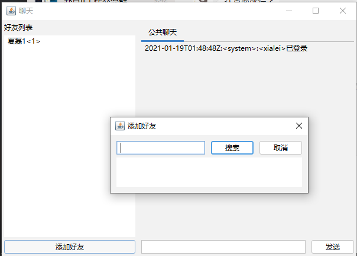

# halia-chat-client

基于Swing+Netty开发的聊天程序客户端，服务端采用 [halia](https://github.com/halia-group/halia) 实现，通过二进制协议通信。

## 功能

+ [x] 用户登录/注册
+ [x] 公共聊天/私聊
+ [x] 好友列表/查找好友/添加好友

## 界面

+ 
+ 
+ 
+ 

## TODO

+ [ ] 申请好友采用按钮打开Dialog形式，不是现在的直接弹出 `JOptionDialog`

## 启动

```bash
java -Dserver.host=127.0.0.1 -Dserver.port=8080 -jar client.jar
```